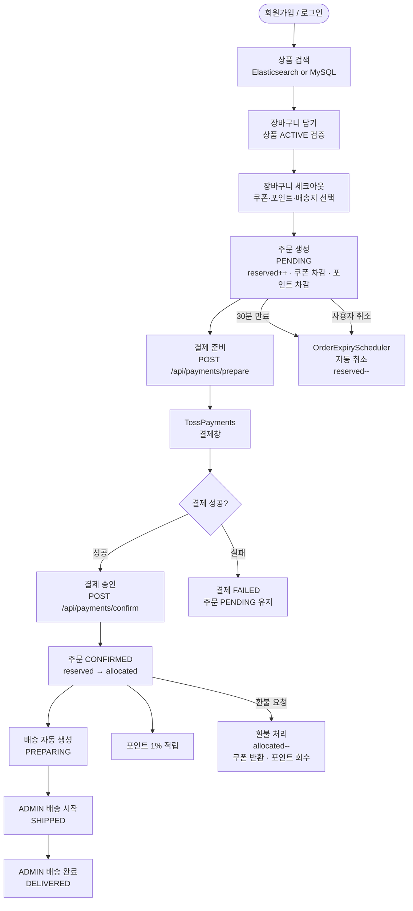
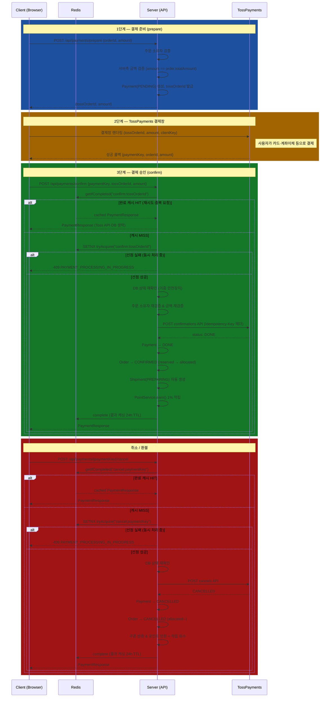
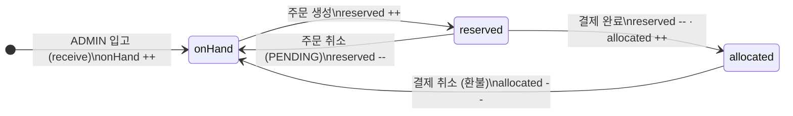
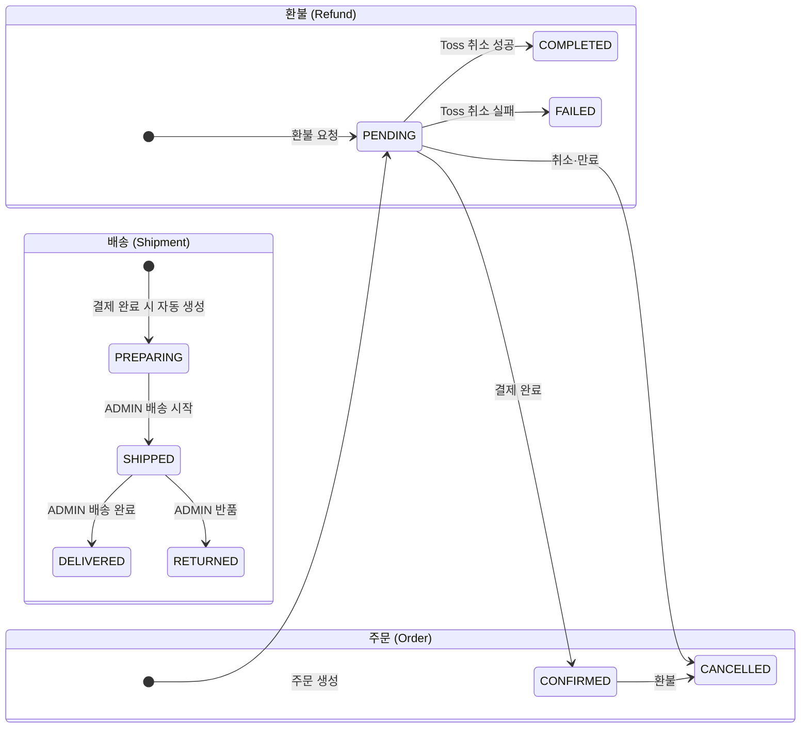
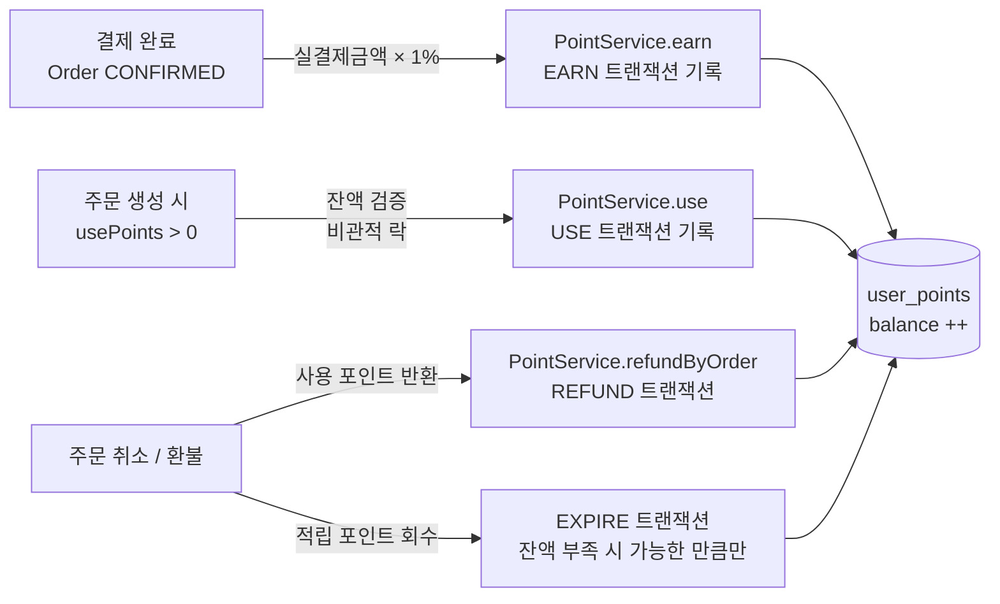

# stock-management-api

Spring Boot 기반 **쇼핑몰 백엔드 포트폴리오 프로젝트**.
재고 → 장바구니 → 주문 → 결제 → 배송 → 환불까지 쇼핑몰 핵심 플로우를 end-to-end로 구현합니다.

---

## 구현 하이라이트

| 주제 | 내용 |
|---|---|
| **동시성 제어** | 재고 뮤테이션에 분산 락(Redisson) + 비관적 락(DB) 2중 적용 — EC2 2대 멀티 인스턴스 환경의 overselling 차단. 결제 취소에 비관적 락으로 TOCTOU 경쟁 조건(이중 환불) 차단 |
| **결제 정합성** | `Propagation.REQUIRES_NEW`로 결제 커밋 보장 — 배송·포인트 실패 시 `UnexpectedRollbackException`으로 결제가 롤백되는 버그 수정. `prepare`·`confirm`·`cancel` 3단계 멱등성(DB UNIQUE + Redis SETNX + Toss `Idempotency-Key`) |
| **이벤트 신뢰성** | Transactional Outbox 패턴 — 이벤트와 비즈니스 로직을 동일 트랜잭션으로 묶어 JVM 크래시 시 이벤트 유실 0 보장. Prometheus `outbox.dead_letters` 게이지로 실시간 모니터링 |
| **N+1 최적화** | `getMyCoupons()` 쿼리 101→3건(97% 감소), 스냅샷 INSERT 1,000→1건. `@EntityGraph` + `default_batch_fetch_size=50` + 복합 인덱스 |
| **Redis 원자성** | 로그인 Rate Limit INCR+EXPIRE 비원자 연산 → Lua 스크립트 원자화 — 앱 크래시 시 TTL 누락으로 계정이 영구 잠금되는 버그 수정 |
| **쿠폰 동시성** | 한정 수량 쿠폰 차감 시 `PESSIMISTIC_WRITE` + TOCTOU 재검증 — 이중 사용 및 초과 발급 방지 |
| **보안** | IDOR 소유권 검증 4개 엔드포인트, 가격 조작 방어(DB canonical price 강제), JWT `userId` 클레임으로 인증 DB round-trip 제거, Toss Webhook HMAC-SHA256 서명 검증 |
| **ES 검색 + Fallback** | 상품 키워드·가격·카테고리 복합 검색(Elasticsearch), 장애 시 자동 MySQL fallback |
| **Circuit Breaker** | TossPayments HTTP 호출 실패 누적 시 회로 차단 → 빠른 실패 응답 |
| **배치 처리** | 쿠폰 만료 비활성화·일별 재고 스냅샷·일별 주문 통계 스케줄러 (`@Scheduled`, `@ConditionalOnProperty`, 멱등성 보장) |
| **테스트 피라미드** | 단위·컨트롤러·통합 테스트 **601개** 전체 통과, Testcontainers로 실제 MySQL·Redis·ES 사용 |

---

## 기술적 개선 사항

개발 중 발견한 버그·성능 문제·보안 취약점과 해결 과정을 정리한 문서입니다.

→ **[docs/IMPROVEMENTS.md](docs/IMPROVEMENTS.md)**

각 항목은 **문제 인식 → 해결 방법 → Trade-off → 결과** 순으로 기술하며,
DAU 50,000명 / 피크 TPS 1,000 req/s / EC2 2대(ALB 뒤 독립 JVM) 규모를 가정한다.

| # | 항목 | 핵심 |
|---|---|---|
| 1 | 재고 동시성 | 분산 락 + 비관적 락 2중 전략, overselling 0건 |
| 2 | 결제 취소 TOCTOU | 비관적 락으로 이중 환불 경쟁 조건 제거 |
| 3 | Redis Lua 원자성 | INCR+EXPIRE 원자화 → 영구 계정 잠금 버그 수정 |
| 4 | 결제 트랜잭션 정합성 | REQUIRES_NEW → UnexpectedRollbackException + 결제 유실 버그 수정 |
| 5 | 결제 멱등성 | 3중 방어 + Redis SPOF 대응 전략 |
| 6 | Transactional Outbox | 이벤트 유실 0 보장 |
| 7 | N+1 / 배치 최적화 | 쿼리 97% 감소, INSERT 99.9% 감소 |
| 8 | 보안 취약점 | IDOR·가격 조작·JWT round-trip·Webhook 위조 |

---

## 기술 스택

| 분류 | 기술 |
|---|---|
| 프레임워크 | Spring Boot 3.5.11, Spring Security 6 |
| 언어 / 빌드 | Java 17, Gradle 8 |
| DB / ORM | MySQL 8, Spring Data JPA (Hibernate 6), Flyway |
| 캐시 / 락 | Redis 7, Redisson 3.27.2 (분산 락), Spring Cache |
| 검색 | Elasticsearch 8.18 (Spring Data Elasticsearch) |
| 인증 | Spring Security 6 + JWT (jjwt 0.12.6), Refresh Token Rotation |
| 결제 | TossPayments Core API v1 |
| 회복탄력성 | Resilience4j Circuit Breaker |
| API 문서 | springdoc-openapi 2.8.4 (Swagger UI) |
| 관리자 | Spring Boot Admin 3.4.3 |
| 테스트 | JUnit 5, Mockito, Testcontainers (MySQL + Redis + Elasticsearch) |
| 인프라 | Docker (멀티스테이지 빌드), Docker Compose |

---

## 로컬 실행

### 방법 1 — Docker Compose 전체 스택 (권장)

사전 요구사항: Docker

```bash
# 환경변수 파일 준비 (필요 시 값 수정)
cp .env.example .env

# 인프라 + 앱 전체 기동 (최초 실행 시 앱 이미지 빌드 포함)
docker compose -f docker/docker-compose.yml up -d
```

앱 재빌드가 필요할 때:

```bash
docker compose -f docker/docker-compose.yml up -d --build app
```

### 방법 2 — 인프라만 Docker, 앱은 로컬 실행 (개발 시)

사전 요구사항: JDK 17+, Docker

```bash
# 인프라만 기동 (MySQL + Redis + Elasticsearch)
docker compose -f docker/docker-compose.yml up -d mysql redis elasticsearch

# 앱 실행
./gradlew bootRun
```

Flyway가 기동 시 V1~V24 마이그레이션을 자동 실행합니다.

### 환경 변수

`.env.example`을 `.env`로 복사 후 필요한 값을 수정하세요. `docker-compose.yml`이 자동으로 `.env`를 로드합니다.

| 변수 | 설명 | 기본값 |
|---|---|---|
| `JWT_SECRET` | JWT 서명 키 (운영 시 반드시 변경, 32자 이상) | 개발용 기본값 |
| `ADMIN_USERNAME` / `ADMIN_PASSWORD` | Spring Boot Admin 계정 | `admin` / `changeme` |
| `TOSS_SECRET_KEY` / `TOSS_CLIENT_KEY` | 토스페이먼츠 API 키 | placeholder |
| `CORS_ALLOWED_ORIGINS` | CORS 허용 출처 | `http://localhost:3000` |

### 접속 URL

| URL | 설명 |
|---|---|
| `http://localhost:8080/swagger-ui/index.html` | Swagger API 문서 |
| `http://localhost:8080/admin-ui` | Spring Boot Admin (인프라 모니터링) |

---

## 테스트

```bash
# 전체 테스트 (Docker 필요 — Testcontainers가 MySQL·Redis·Elasticsearch 컨테이너를 자동으로 띄움)
./gradlew test

# 커버리지 리포트
./gradlew jacocoTestReport
# build/reports/jacoco/test/html/index.html
```

### 테스트 구조

| 종류 | 위치 | 설명 |
|---|---|---|
| 단위 | `domain/*/service/`, `entity/`, `common/lock/`, `security/` | Mockito, 외부 의존성 격리 |
| 컨트롤러 | `domain/*/controller/` | `@WebMvcTest`, MockMvc, 보안 필터 포함 |
| 통합 | `integration/` | Testcontainers (MySQL + Redis + ES), Flyway 실행, 실제 HTTP 흐름 E2E |
| 동시성 | `integration/InventoryConcurrencyTest` | 동시 입고 lost update · 재고 예약 overselling 검증 |

현재 총 **601개** 테스트 전체 통과.

---

## 프로젝트 구조

```
com.stockmanagement/
├── common/
│   ├── config/          # SecurityConfig, AdminSecurityConfig, SpringBootAdminConfig
│   │                    # JpaConfig, RedisConfig, CacheConfig, OpenApiConfig, TossPaymentsConfig
│   ├── dto/             # ApiResponse<T> — 전 엔드포인트 통합 응답 래퍼
│   ├── event/           # DomainEvent, OrderCreated/Cancelled, PaymentConfirmed, LowStock
│   ├── exception/       # BusinessException, InsufficientStockException, ErrorCode, GlobalExceptionHandler
│   ├── filter/          # RequestIdFilter (MDC requestId 주입)
│   ├── lock/            # @DistributedLock (어노테이션), DistributedLockAspect (AOP)
│   ├── outbox/          # OutboxEvent, OutboxEventStore, OutboxEventRelayScheduler
│   ├── ratelimit/       # @RateLimit (어노테이션), RateLimitAspect (AOP, Redis)
│   └── security/        # LoginRateLimiter, JwtBlacklist, RefreshTokenStore
├── domain/
│   ├── product/         # 상품 CRUD + Elasticsearch 검색 (document/, service/ProductSearchService)
│   │   ├── category/    # 카테고리 계층 구조 (parent-child 2단계)
│   │   ├── image/       # 상품 이미지 (MinIO S3 Presigned URL)
│   │   ├── review/      # 상품 리뷰 (구매자 전용, 1인 1리뷰)
│   │   └── wishlist/    # 찜 목록
│   ├── inventory/       # 재고 4-state 모델 + 변동 이력 + 필터 검색 + 일별 스냅샷
│   │   └── scheduler/   # InventorySnapshotScheduler (매일 자정 5분)
│   ├── order/           # 주문 생성·취소, 멱등성 키, 상태 이력, 만료 자동 취소, 필터 조회, 일별 통계
│   │   ├── cart/        # 장바구니 담기·수정·삭제·체크아웃
│   │   └── scheduler/   # DailyOrderStatsScheduler (매일 자정 1분)
│   ├── payment/         # TossPayments 연동, 결제 준비·확인·취소, Circuit Breaker
│   ├── coupon/          # 쿠폰 생성·검증·적용·반환, FIXED_AMOUNT/PERCENTAGE, 비관적 락
│   │   └── scheduler/   # CouponExpiryScheduler (매일 새벽 1시)
│   ├── point/           # 포인트 적립·사용·환불 (결제금액 1% 자동 적립)
│   ├── shipment/        # 배송 상태 관리 (PREPARING→SHIPPED→DELIVERED/RETURNED)
│   ├── refund/          # 환불 이력 관리 (PENDING→COMPLETED/FAILED)
│   ├── user/            # 회원가입·로그인, ADMIN/USER 역할, Refresh Token
│   │   └── address/     # 배송지 관리 (기본 배송지, 주문 연동)
│   └── admin/           # 관리자 대시보드, 사용자 관리, 전체 주문 조회, 배치 통계 조회
│       └── setting/     # 시스템 설정 (저재고 임계값 동적 관리)
└── security/            # JwtTokenProvider, JwtAuthenticationFilter
```

각 도메인: `entity / repository / service / controller / dto`

---

## ERD

전체 테이블과 관계를 나타낸 Entity-Relationship Diagram입니다.

```mermaid
erDiagram
    %% ── USER ─────────────────────────────────────────────
    users {
        bigint id PK
        varchar username UK
        varchar password
        varchar email UK
        varchar role "USER|ADMIN"
        datetime deleted_at "NULL=활성 계정"
        datetime created_at
    }
    delivery_addresses {
        bigint id PK
        bigint user_id FK
        varchar alias "집·회사 등"
        varchar recipient
        varchar phone
        varchar zip_code
        varchar address1
        varchar address2
        tinyint is_default
    }

    %% ── PRODUCT ──────────────────────────────────────────
    categories {
        bigint id PK
        varchar name UK
        bigint parent_id FK "NULL=최상위"
    }
    products {
        bigint id PK
        varchar name
        decimal price
        varchar sku UK
        varchar status "ACTIVE|INACTIVE|DISCONTINUED"
        varchar thumbnail_url
        bigint category_id FK
    }
    product_images {
        bigint id PK
        bigint product_id FK
        varchar image_url
        varchar object_key
        varchar image_type "THUMBNAIL|DETAIL"
        int display_order
    }
    reviews {
        bigint id PK
        bigint product_id FK
        bigint user_id FK
        tinyint rating "1–5"
        varchar title
        text content
    }
    wishlist_items {
        bigint id PK
        bigint user_id FK
        bigint product_id FK
    }

    %% ── INVENTORY ────────────────────────────────────────
    inventory {
        bigint id PK
        bigint product_id UK "FK, 상품당 1행"
        int on_hand "창고 실물 수량"
        int reserved "주문 생성 보류"
        int allocated "결제 완료 확정"
        int version "낙관적 락"
    }
    inventory_transactions {
        bigint id PK
        bigint inventory_id FK
        varchar type "RECEIVE|RESERVE|RELEASE|CONFIRM|..."
        int quantity
        varchar note
        int snapshot_on_hand
        int snapshot_reserved
        int snapshot_allocated
    }

    %% ── ORDER ────────────────────────────────────────────
    cart_items {
        bigint id PK
        bigint user_id FK
        bigint product_id FK
        int quantity
    }
    orders {
        bigint id PK
        bigint user_id FK
        varchar status "PENDING|CONFIRMED|CANCELLED"
        decimal total_amount
        varchar idempotency_key UK
        bigint delivery_address_id FK "NULL=미지정"
        bigint coupon_id FK "NULL=미사용"
        decimal discount_amount
        bigint used_points
    }
    order_items {
        bigint id PK
        bigint order_id FK
        bigint product_id FK
        int quantity
        decimal unit_price "주문 당시 단가"
        decimal subtotal
    }
    order_status_history {
        bigint id PK
        bigint order_id FK
        varchar from_status
        varchar to_status
        varchar changed_by
        varchar note
    }

    %% ── PAYMENT ──────────────────────────────────────────
    payments {
        bigint id PK
        bigint order_id UK "FK"
        varchar payment_key "Toss 발급, DONE 이후 설정"
        varchar toss_order_id UK
        decimal amount
        varchar status "PENDING|DONE|FAILED|CANCELLED"
        varchar method "카드|가상계좌 등"
        datetime requested_at
        datetime approved_at
    }

    %% ── COUPON ───────────────────────────────────────────
    coupons {
        bigint id PK
        varchar code UK
        varchar name
        varchar discount_type "FIXED_AMOUNT|PERCENTAGE"
        decimal discount_value
        decimal minimum_order_amount
        decimal max_discount_amount
        int max_usage_count "NULL=무제한"
        int usage_count
        int max_usage_per_user
        datetime valid_from
        datetime valid_until
        tinyint active
    }
    coupon_usages {
        bigint id PK
        bigint coupon_id FK
        bigint user_id FK
        bigint order_id UK "FK, 주문당 1건"
        decimal discount_amount
        datetime used_at
    }

    %% ── POINT ────────────────────────────────────────────
    user_points {
        bigint id PK
        bigint user_id UK "FK"
        bigint balance
    }
    point_transactions {
        bigint id PK
        bigint user_id FK
        bigint amount "양수=적립·환불, 음수=사용·소멸"
        varchar type "EARN|USE|REFUND|EXPIRE"
        varchar description
        bigint order_id "NULL 가능"
    }

    %% ── SHIPMENT ─────────────────────────────────────────
    shipments {
        bigint id PK
        bigint order_id UK "FK"
        varchar status "PREPARING|SHIPPED|DELIVERED|RETURNED"
        varchar carrier
        varchar tracking_number
        datetime shipped_at
        datetime delivered_at
    }

    %% ── REFUND ───────────────────────────────────────────
    refunds {
        bigint id PK
        bigint payment_id UK "FK, 결제당 1건"
        bigint order_id FK
        decimal amount
        varchar reason
        varchar status "PENDING|COMPLETED|FAILED"
        datetime completed_at
    }

    %% ── SYSTEM ───────────────────────────────────────────
    system_settings {
        bigint id PK
        varchar setting_key UK
        varchar setting_value
        varchar description
        datetime updated_at
        varchar updated_by
    }

    %% ── RELATIONSHIPS ────────────────────────────────────
    users ||--o{ delivery_addresses : "배송지"
    users ||--o{ orders : "주문"
    users ||--o{ cart_items : "장바구니"
    users ||--o{ reviews : "리뷰"
    users ||--o{ wishlist_items : "위시리스트"
    users ||--o| user_points : "포인트 잔액 (1:1)"
    users ||--o{ point_transactions : "포인트 이력"
    users ||--o{ coupon_usages : "쿠폰 사용"

    categories ||--o{ categories : "하위 카테고리"
    categories ||--o{ products : "상품 분류"

    products ||--|| inventory : "재고 (1:1)"
    products ||--o{ product_images : "이미지"
    products ||--o{ order_items : "주문 항목"
    products ||--o{ cart_items : "장바구니"
    products ||--o{ reviews : "리뷰"
    products ||--o{ wishlist_items : "찜"

    inventory ||--o{ inventory_transactions : "변동 이력"

    delivery_addresses ||--o{ orders : "배송지 적용"

    coupons ||--o{ coupon_usages : "사용 이력"

    orders ||--|{ order_items : "주문 항목"
    orders ||--o{ order_status_history : "상태 이력"
    orders ||--o| payments : "결제 (1:1)"
    orders ||--o| shipments : "배송 (1:1)"
    orders ||--o| coupon_usages : "쿠폰 적용 (1:1)"
    orders ||--o| refunds : "환불 (1:1)"

    payments ||--o| refunds : "환불 처리 (1:1)"
```



---

## 기능 흐름도

### 전체 쇼핑 플로우



---

### TossPayments 결제 연동 플로우



---

### 재고 상태 전이

```
available = onHand - reserved - allocated
```



| 이벤트 | onHand | reserved | allocated | available |
|---|---|---|---|---|
| ADMIN 입고 | `+N` | — | — | `+N` |
| 주문 생성 | — | `+N` | — | `-N` |
| 결제 완료 | — | `-N` | `+N` | — |
| 주문 취소 (결제 전) | — | `-N` | — | `+N` |
| 환불 (결제 후) | — | — | `-N` | `+N` |

---

### 주문 · 배송 · 환불 상태 전이



---

### 포인트 적립 / 사용 / 환불 흐름



---

## 핵심 설계

### Inventory — 재고 4-state 모델

```
available = onHand - reserved - allocated
```

모든 변동은 `InventoryTransaction`에 이력으로 기록됩니다.

### 동시성 제어 — 2중 락

재고 뮤테이션 메서드에 분산 락과 비관적 락을 순서대로 적용합니다.

```
요청 → @DistributedLock (Redis, waitTime 5s) → @Lock(PESSIMISTIC_WRITE) (DB) → 재고 변경
```

- **분산 락**: 멀티 인스턴스 환경에서 Redis를 통해 직렬화 (key: `lock:inventory:{productId}`)
- **비관적 락**: DB 레벨 lost update 방지 (`SELECT ... FOR UPDATE`)

### Order — 멱등성 보장

`idempotencyKey` DB UNIQUE 제약. 같은 키로 재요청 시 기존 주문 반환.

### 만료 주문 자동 취소

`OrderExpiryScheduler`가 주기적으로 `PENDING` 상태 만료 주문을 스캔해 자동 취소 처리합니다.
테스트 환경에서는 `order.expiry.enabled=false`로 비활성화합니다.

### Coupon — 할인 도메인

두 가지 할인 타입을 지원합니다.

| 타입 | 계산 |
|---|---|
| `FIXED_AMOUNT` | `min(discountValue, orderAmount)` |
| `PERCENTAGE` | `min(orderAmount × rate/100, maxDiscountAmount)` |

쿠폰 적용 흐름:

```
[미리보기] POST /api/coupons/validate  →  읽기 전용, 할인 금액 계산만
[주문 생성] POST /api/orders (couponCode 포함)
           → CouponService.applyCoupon()  — PESSIMISTIC_WRITE + TOCTOU 재검증
           → Coupon.usageCount++, CouponUsage 저장
           → Order에 discountAmount·couponId 기록

[주문 취소] → CouponService.releaseCoupon()
           → CouponUsage 삭제, Coupon.usageCount--
```

### Payment — TossPayments 2-step

```
준비(/prepare) → [프론트 결제창] → 확인(/confirm)
                                         ├─ 성공: Payment DONE, Order CONFIRMED, reserved→allocated
                                         │        Shipment 자동 생성 (PREPARING), 포인트 1% 적립
                                         └─ 실패: Payment FAILED

결제 후 취소(/cancel): Payment CANCELLED, Order CANCELLED, allocated 해제
                       쿠폰 반환, 포인트 반환 + 적립금 회수
```

**결제 멱등성 3중 전략**

| 레이어 | 전략 |
|---|---|
| `prepare()` | `payments.order_id` DB UNIQUE 제약 |
| `confirm()` / `cancel()` | Redis SETNX로 PROCESSING 상태 원자적 선점, 결과 24h 캐싱 |
| Toss API 호출 | `Idempotency-Key: {tossOrderId}` 헤더 |

**Circuit Breaker**: TossPayments 연속 실패 시 회로 차단 → 빠른 실패 응답.

### Elasticsearch 상품 검색

`GET /api/products` 쿼리 파라미터로 조건을 조합합니다.

| 파라미터 | 설명 |
|---|---|
| `q` | 키워드 (name · sku · category · description multi_match) |
| `minPrice` / `maxPrice` | 가격 범위 필터 |
| `category` | 카테고리 정확 일치 |
| `sort` | `price_asc` / `price_desc` / `newest` / `relevance` (기본) |

검색 조건이 없으면 MySQL 조회, ES 장애 시 MySQL fallback.

### 배치 처리 — 3개 스케줄러

`@Scheduled` + `@ConditionalOnProperty` 패턴으로 환경별 활성화를 제어합니다.

| 스케줄러 | 실행 시각 | 동작 |
|---|---|---|
| `CouponExpiryScheduler` | 매일 새벽 1시 | 만료된 활성 쿠폰 `deactivate()` (Dirty Checking) |
| `InventorySnapshotScheduler` | 매일 자정 5분 | 전체 재고 → `daily_inventory_snapshots` 저장 (중복 스킵) |
| `DailyOrderStatsScheduler` | 매일 자정 1분 | 전일 주문 집계 → `daily_order_stats` upsert |

통합 테스트에서는 `*.enabled=false`로 비활성화, `BatchIntegrationTest`에서 `@TestPropertySource`로 재활성화 후 직접 호출 검증.

---

## DB 마이그레이션

| 버전 | 내용 |
|---|---|
| V1 | `products` — 상품 마스터 |
| V2 | `inventory` — 재고 (onHand / reserved / allocated) |
| V3 | `orders`, `order_items` — 주문 |
| V4 | `payments` — 결제 |
| V5 | `users`, `orders.user_id FK` 추가 |
| V6 | `inventory_transactions` — 재고 변동 이력 |
| V7 | `inventory_transactions.note` 컬럼 추가 |
| V8 | `payments.order_id UNIQUE` 제약 추가 |
| V9 | `order_status_history` — 주문 상태 변경 이력 |
| V10 | `cart_items` — 장바구니 |
| V11 | `shipments` — 배송 |
| V12 | `delivery_addresses`, `orders.delivery_address_id FK` 추가 |
| V13 | `coupons`, `coupon_usages`, `orders.coupon_id / discount_amount` 추가 |
| V14 | `categories`, `products.category_id FK` 추가 (category VARCHAR 제거) |
| V15 | `daily_order_stats`, `daily_inventory_snapshots` — 배치 집계 |
| V16 | `users.deleted_at` — Soft Delete |
| V17 | `product_images`, `products.thumbnail_url` — 상품 이미지 |
| V18 | `outbox_events` — Transactional Outbox 패턴 |
| V19 | `reviews`, `wishlist_items` — 리뷰 · 위시리스트 |
| V20 | `user_points`, `point_transactions`, `orders.used_points` — 포인트 |
| V21 | `refunds` — 환불 이력 |
| V22 | `user_coupons` — 관리자 쿠폰 발급 이력 |
| V23 | `orders` 복합 인덱스 추가 (성능) |
| V24 | `system_settings` — 동적 시스템 설정 (저재고 임계값 등) |

---

## API 엔드포인트

> Swagger UI에서 직접 테스트 가능: `http://localhost:8080/swagger-ui/index.html`

### 인증 / 사용자

| Method | Endpoint | 설명 | 권한 |
|---|---|---|---|
| POST | `/api/auth/signup` | 회원가입 | 공개 |
| POST | `/api/auth/login` | 로그인 → JWT + Refresh Token | 공개 |
| POST | `/api/auth/logout` | 로그아웃 (JWT 블랙리스트 + Refresh Token revoke) | 공개 |
| POST | `/api/auth/refresh` | Access Token 재발급 (Refresh Token rotation) | 공개 |
| GET | `/api/users/me` | 내 정보 조회 | USER |
| DELETE | `/api/users/me` | 회원 탈퇴 (Soft Delete + Refresh Token 일괄 폐기) | USER |

### 상품

| Method | Endpoint | 설명 | 권한 |
|---|---|---|---|
| POST | `/api/products` | 상품 등록 | ADMIN |
| GET | `/api/products` | 상품 목록 (ES 검색 or MySQL, `?q=&minPrice=&maxPrice=&category=&sort=`) | 공개 |
| GET | `/api/products/{id}` | 상품 단건 조회 | 공개 |
| PUT | `/api/products/{id}` | 상품 수정 | ADMIN |
| DELETE | `/api/products/{id}` | 상품 삭제 (soft delete → DISCONTINUED) | ADMIN |

### 카테고리

| Method | Endpoint | 설명 | 권한 |
|---|---|---|---|
| POST | `/api/categories` | 카테고리 생성 | ADMIN |
| GET | `/api/categories` | 카테고리 트리 조회 (parent-child) | 공개 |
| GET | `/api/categories/{id}` | 카테고리 단건 조회 | 공개 |
| PUT | `/api/categories/{id}` | 카테고리 수정 | ADMIN |
| DELETE | `/api/categories/{id}` | 카테고리 삭제 (하위·상품 존재 시 거부) | ADMIN |

### 상품 이미지

| Method | Endpoint | 설명 | 권한 |
|---|---|---|---|
| POST | `/api/products/{id}/images/presigned` | 이미지 업로드용 Presigned URL 발급 | ADMIN |
| GET | `/api/products/{id}/images` | 상품 이미지 목록 | 공개 |
| DELETE | `/api/products/{id}/images/{imageId}` | 이미지 삭제 | ADMIN |

### 리뷰

| Method | Endpoint | 설명 | 권한 |
|---|---|---|---|
| POST | `/api/products/{id}/reviews` | 리뷰 작성 (구매 확인, 1인 1리뷰) | USER |
| GET | `/api/products/{id}/reviews` | 상품 리뷰 목록 + 평균 별점 | 공개 |
| DELETE | `/api/products/{id}/reviews/{reviewId}` | 리뷰 삭제 (본인만) | USER |

### 위시리스트

| Method | Endpoint | 설명 | 권한 |
|---|---|---|---|
| POST | `/api/wishlist/{productId}` | 찜 추가 | USER |
| DELETE | `/api/wishlist/{productId}` | 찜 제거 | USER |
| GET | `/api/wishlist` | 찜 목록 조회 | USER |

### 재고

| Method | Endpoint | 설명 | 권한 |
|---|---|---|---|
| GET | `/api/inventory` | 재고 목록 (`?status=&productId=` 필터) | USER |
| GET | `/api/inventory/{productId}` | 재고 현황 조회 | USER |
| GET | `/api/inventory/{productId}/transactions` | 재고 변동 이력 (페이징) | USER |
| POST | `/api/inventory/{productId}/receive` | 입고 처리 | ADMIN |
| POST | `/api/inventory/{productId}/adjust` | 재고 조정 | ADMIN |

### 주문

| Method | Endpoint | 설명 | 권한 |
|---|---|---|---|
| POST | `/api/orders` | 주문 생성 (재고 예약, 멱등성, 쿠폰·포인트·배송지 적용) | USER |
| GET | `/api/orders` | 주문 목록 (USER=본인, ADMIN=전체, `?status=&userId=&startDate=&endDate=`) | USER |
| GET | `/api/orders/{id}` | 주문 단건 조회 (본인 주문만) | USER |
| GET | `/api/orders/{id}/history` | 주문 상태 변경 이력 (본인 주문만) | USER |
| POST | `/api/orders/{id}/cancel` | 주문 취소 (재고 예약 해제, 쿠폰·포인트 반환) | USER |

### 쿠폰

| Method | Endpoint | 설명 | 권한 |
|---|---|---|---|
| POST | `/api/coupons` | 쿠폰 생성 | ADMIN |
| GET | `/api/coupons` | 쿠폰 목록 (페이징) | ADMIN |
| GET | `/api/coupons/{id}` | 쿠폰 상세 | ADMIN |
| PATCH | `/api/coupons/{id}/deactivate` | 쿠폰 비활성화 | ADMIN |
| POST | `/api/coupons/validate` | 쿠폰 유효성 확인 + 할인 금액 미리보기 | USER |

### 결제

| Method | Endpoint | 설명 | 권한 |
|---|---|---|---|
| POST | `/api/payments/prepare` | 결제 준비 (본인 주문만) | USER |
| POST | `/api/payments/confirm` | 결제 승인 (배송·포인트 자동 처리, 본인 주문만) | USER |
| POST | `/api/payments/{paymentKey}/cancel` | 결제 취소/환불 | USER |
| GET | `/api/payments/{paymentKey}` | 결제 조회 | USER |
| GET | `/api/payments/order/{orderId}` | 주문 ID로 결제 조회 (본인 주문만) | USER |
| POST | `/api/payments/webhook` | TossPayments 웹훅 | 공개 |

### 장바구니

| Method | Endpoint | 설명 | 권한 |
|---|---|---|---|
| GET | `/api/cart` | 장바구니 조회 | USER |
| POST | `/api/cart/items` | 상품 담기 / 수량 변경 (ACTIVE 상품만) | USER |
| DELETE | `/api/cart/items/{productId}` | 상품 제거 | USER |
| DELETE | `/api/cart` | 장바구니 비우기 | USER |
| POST | `/api/cart/checkout` | 장바구니 → 주문 전환 (쿠폰·포인트·배송지 포함) | USER |

### 배송

| Method | Endpoint | 설명 | 권한 |
|---|---|---|---|
| GET | `/api/shipments/orders/{orderId}` | 주문 배송 조회 (본인 주문만) | USER |
| PATCH | `/api/shipments/{id}/ship` | 배송 시작 (PREPARING → SHIPPED) | ADMIN |
| PATCH | `/api/shipments/{id}/deliver` | 배송 완료 (SHIPPED → DELIVERED) | ADMIN |
| PATCH | `/api/shipments/{id}/return` | 반품 처리 (SHIPPED → RETURNED) | ADMIN |

### 배송지

| Method | Endpoint | 설명 | 권한 |
|---|---|---|---|
| POST | `/api/delivery-addresses` | 배송지 등록 | USER |
| GET | `/api/delivery-addresses` | 배송지 목록 | USER |
| GET | `/api/delivery-addresses/{id}` | 배송지 단건 조회 | USER |
| PUT | `/api/delivery-addresses/{id}` | 배송지 수정 | USER |
| DELETE | `/api/delivery-addresses/{id}` | 배송지 삭제 (기본 배송지 삭제 시 자동 승격) | USER |
| POST | `/api/delivery-addresses/{id}/default` | 기본 배송지 설정 | USER |

### 포인트

| Method | Endpoint | 설명 | 권한 |
|---|---|---|---|
| GET | `/api/points/balance` | 포인트 잔액 조회 | USER |
| GET | `/api/points/history` | 포인트 변동 이력 (페이징) | USER |

### 환불

| Method | Endpoint | 설명 | 권한 |
|---|---|---|---|
| POST | `/api/refunds` | 환불 요청 (DONE 결제만 가능, 본인 주문만) | USER |
| GET | `/api/refunds/{id}` | 환불 단건 조회 (본인만) | USER |
| GET | `/api/payments/{paymentId}/refund` | 결제 ID로 환불 조회 (본인만) | USER |

### 관리자 REST API

ADMIN JWT 인증 필요.

| Method | Endpoint | 설명 |
|---|---|---|
| GET | `/api/admin/dashboard` | 주문 통계, 매출, 사용자 수, 저재고 목록 |
| GET | `/api/admin/users` | 전체 사용자 목록 (페이징) |
| PATCH | `/api/admin/users/{id}/role` | 사용자 권한 변경 (USER ↔ ADMIN) |
| GET | `/api/admin/orders` | 전체 주문 목록 (`?status=` 필터) |
| GET | `/api/admin/products` | 전체 상품 목록 (ACTIVE + DISCONTINUED) |
| GET | `/api/admin/stats/orders` | 기간별 일별 주문·매출 통계 (`?from=&to=`) |
| GET | `/api/admin/stats/inventory` | 특정 날짜 전체 재고 스냅샷 (`?date=`) |
| GET | `/api/admin/settings/low-stock-threshold` | 저재고 경보 임계값 조회 |
| PUT | `/api/admin/settings/low-stock-threshold` | 저재고 경보 임계값 변경 |

---

## 요청/응답 예시

모든 응답은 `ApiResponse<T>` 래퍼로 반환됩니다.

```json
{ "success": true,  "data": { ... } }
{ "success": false, "message": "재고가 부족합니다." }
```

### 로그인

```http
POST /api/auth/login
{ "username": "user123", "password": "password123!" }
```

```json
{
  "success": true,
  "data": {
    "accessToken": "eyJ...",
    "tokenType": "Bearer",
    "expiresIn": 86400,
    "refreshToken": "uuid-..."
  }
}
```

### 상품 검색

```http
GET /api/products?q=노트북&minPrice=500000&maxPrice=2000000&category=전자&sort=price_asc
```

### 쿠폰 + 포인트 적용 주문 생성

```http
POST /api/orders
Authorization: Bearer <token>
{
  "idempotencyKey": "550e8400-e29b-41d4-a716-446655440000",
  "couponCode": "FIXED5000",
  "usePoints": 3000,
  "deliveryAddressId": 1,
  "items": [{ "productId": 1, "quantity": 2, "unitPrice": 30000 }]
}
```

```json
{
  "success": true,
  "data": {
    "id": 1, "status": "PENDING",
    "totalAmount": 60000, "discountAmount": 5000, "usedPoints": 3000,
    "couponId": 3, "items": [...]
  }
}
```

### 쿠폰 할인 미리보기

```http
POST /api/coupons/validate
Authorization: Bearer <token>
{ "couponCode": "FIXED5000", "orderAmount": 60000 }
```

```json
{
  "success": true,
  "data": {
    "couponCode": "FIXED5000", "couponName": "5천원 할인",
    "orderAmount": 60000, "discountAmount": 5000, "finalAmount": 55000
  }
}
```

---

## 보안

| 체인 | 우선순위 | 경로 | 인증 방식 |
|---|---|---|---|
| `AdminSecurityConfig` | @Order(1) | `/admin-ui/**`, `/instances/**` | Form Login + 세션 |
| `SecurityConfig` | @Order(2) | 나머지 전체 | JWT (stateless) |

- 미인증 → 403
- 공개: `/api/auth/**`, `/api/products/**`, `/api/categories/**`, `/actuator/health`, `/actuator/info`, `/api/payments/webhook`, `/swagger-ui/**`
- ADMIN 전용: `/actuator/**` (health/info 제외), 상품·재고 write, 쿠폰 관리, 배송 상태 변경, 카테고리 write

### 추가 보안 기능

| 기능 | 구현 |
|---|---|
| 로그인 Rate Limiting | Redis 기반, 15분 내 5회 초과 시 429 |
| API Rate Limiting | 주문 생성 10회/분, 결제 확정 5회/분 (AOP, Redis) |
| JWT 블랙리스트 | 로그아웃 시 jti로 Redis에 등록, 토큰 만료까지 유효 |
| Refresh Token Rotation | 발급 시 이전 토큰 자동 revoke (Redis, TTL 30일) |
| Refresh Token 일괄 폐기 | 회원 탈퇴 시 해당 사용자의 모든 Refresh Token 즉시 폐기 |
| IDOR 방어 | 주문·결제·배송·환불 조회 시 소유자 검증 (username + isAdmin) |
| Toss 웹훅 서명 검증 | `Toss-Signature` 헤더 HMAC-SHA256 검증 |
| CORS | `cors.allowed-origins` 환경 변수로 허용 도메인 제어 |
| MDC Logging | 요청별 `requestId` 자동 주입 (RequestIdFilter) |

---

## Spring Boot Admin — 인프라 모니터링

`http://localhost:8080/admin-ui` (계정: `admin` / `changeme`)

| 기능 | 설명 |
|---|---|
| 애플리케이션 상태 | Health, 메모리/힙/GC, 스레드 |
| HTTP 트레이스 | 최근 요청/응답 내역 |
| 로그 레벨 | 런타임에서 패키지별 레벨 즉시 변경 |
| 빈 목록 | Spring 컨텍스트의 전체 빈 확인 |
| 환경변수 | application.properties 설정값 조회 |

---

## 라이선스

MIT License
